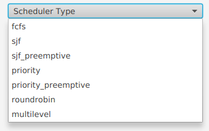
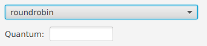
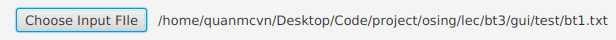
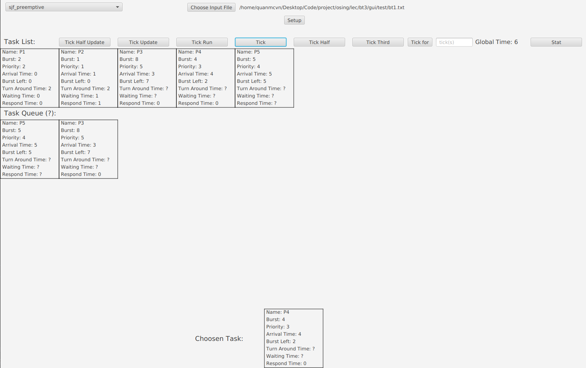
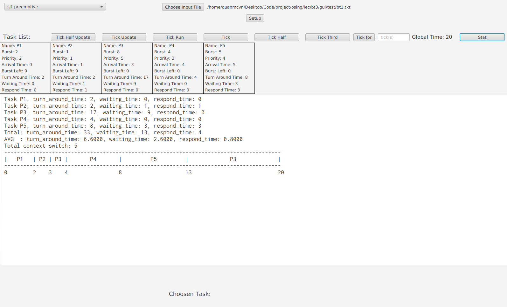

<h3>Scheduler Programing Project</h3> 

Project for homework "Lập trình các thuật toán lập lịch cho CPU (dùng bất cứ ngôn ngữ lập trình nào): FCFS, SJF (Preemptive, preemptive), Priority (Preemptive, preemptive), Round Robin (chương trình vẽ biểu đồ GANT, tính thời gian hoàn thành trung bình, chờ trung bình, phản hồi trung bình )"

aka program the scheduler and report stats (tat, waiting time, respond time, context switches, gantt chart)

<h4>Installation</h4>
Clone this repo and open with Intellij IDEA (hope it works)

Run the src/main/java/com/gui/Main.java (or the GUI run config in Intellij)

<h4>How to use</h4>

Choose scheduler type

Choosing round robin will open input for quantum

(the multilevel is hardcoded (sorry!) to having 3 queues, round robin quantum = 20, sjf preemptive and fcfs)

Choose Input File

The current task list only support viewing at most 10 tasks. 
Why, you ask. 
Because there is only so much width I can cramped before the task is too small or the width is too big.

File input format is `name, burst time, priority, arrival time, queue level` (even though queue level is only needed in multilevel, it will complain if the format is incorrect)

Smaller number in priority will be run fist (prio 1 > prio 2)

There are 2 tests in `test/` (actually it's from the homework 1, one stone two birds)

Click `Setup`

<h4>How to use (part 2) </h4>

Now that the task list has been loaded, there are 8 more buttons.

First, some theory. There are 3 phases in 1 tick (I made it up for easy showing):
- The OS is notified when there is (are) task(s) coming in, it will then add that (those) task(s) to the scheduler's queue
- The scheduler report the task will be ran next (removing that task from the ready queue, and put that task to be ran next)
- The task is ran, some of the stats will be changed here (tat, waiting time, respond time, context switches)

`Tick Half Update` will run the first phase 

`Tick Update` will run the the second phase (but will silently run `Tick Half Update` first)

`Tick Run` will run the last phase (will not silently run `Tick Half Update` nor `Tick Update`, and will not run without running `Tick Update` first)

Multiple `Tick Half Update` or `Tick Update` without `Tick Run` won't do anything (and vice versa)

`Tick` will run both `Tick Update` and `Tick Run` (advance 1 tick)

`Tick Half` will try to run `Tick Update`, if it failed (because it's ran before) then it will try to run `Tick Run` (advance 2/3 or 1/3 ticks)

`Tick Third` is the same as `Tick Half`, but the order is `Tick Half Update`, `Tick Update`, `Tick Run` (advance 1/3 ticks)

`Tick for` will run `Tick` for `ticks` (input from the text field to the right of the button)

`Stat` will show the stats (tat, waiting time, respond time, context switches, gantt chart) after every tasks is ran (Burst Left = 0)

`Global Time: x` is not a button (duh), it displays the current time

<h4> Demo </h4>

<h4> Side quirk </h4>

If there is no task to run, os will run dummy task `sleep` with big arrival time, big burst left, least priority (not that it matters)

Because the problem wants to minimize context switches (when there are more than 1 tasks can be run, priotize the task that match last task ran to minimize context switches), there is no way to use the priority queue in sjf_preemptive and priority_preemptive. They actually use a list and sort whenever needed (too bad).